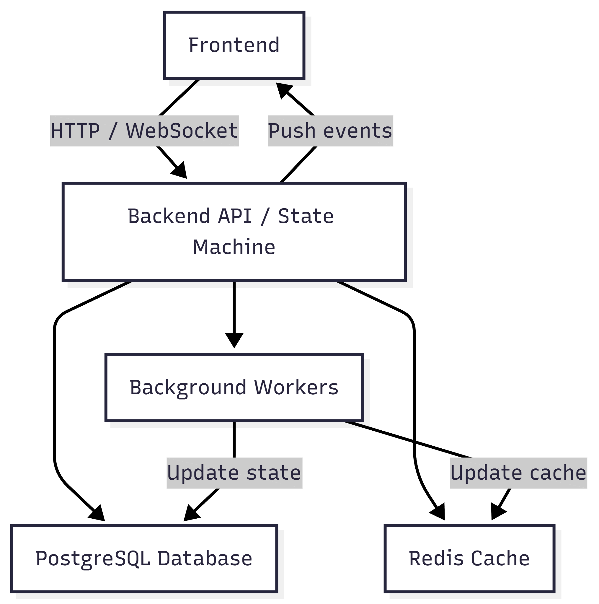

# WaitWise V1

**WaitWise** is a virtual queue management system designed to manage service queues reliably, even under concurrency and time-based transitions.  
It ensures users are served in order, respects capacity limits, and handles late or missed turns automatically.

---

## Quick Overview

- **Queue-centric:** Users join queues and progress through a strict state machine.
- **Transactional:** All operations are validated and atomic.
- **Time-driven:** Background workers handle expiry and late/missed transitions.
- **Realtime:** WebSocket events keep the UI updated.
- **Safe under concurrency:** Multiple users joining, leaving, or being promoted at the same time cannot break the queue.

---

## Core Concepts

- **Queue:** Container for users waiting for service.
- **QueueUser:** A user's participation in a queue.
- **States:** `WAITING`, `SERVING`, `LATE`, `MISSED`, `CANCELLED`, `COMPLETED`.
- **Service Slots:** Maximum number of users being served at once.
- **Grace Time / Expiry:** Users may rejoin if late; turns expire automatically.

---

## Key Features

- Strict **state machine** for QueueUser transitions.
- **Idempotent** operations; safe to retry.
- **Background workers** enforce expiry and late/missed transitions.
- **WebSocket events** broadcast state changes for realtime updates.
- Comprehensive **invariant enforcement**: capacity, ordering, and temporal correctness.
- **TTL-controlled caching** ensures freshness while improving performance.

---

## API Overview

Endpoints are grouped by role:

- **Auth:** login, logout, refresh tokens
- **Queue:** create, update, view, delete queues
- **User:** join, leave, rejoin, check status
- **Admin:** complete, mark late, remove users, list users

> All endpoints trigger **state transitions**, validate invariants, and execute inside transactions.

---

## Concurrency & Reliability

- Multiple users can join or leave simultaneously (**joinStorm / leaveStorm**) without breaking the queue.
- Promotions and completions validate state and enforce slot limits.
- Background workers run idempotent jobs with retries and exponential backoff:
  - Unique `jobId` per queue (`promote-if-free-slot-<queueId>`)
  - 5 attempts with exponential delay (5s)
  - Successful jobs removed automatically, failed jobs retained for inspection

---

## Documentation

WaitWise includes detailed documentation for deeper understanding:

| Doc                                               | Purpose                                     |
| ------------------------------------------------- | ------------------------------------------- |
| [SYSTEM.md](docs/SYSTEM.md)                       | Architecture overview and design philosophy |
| [INVARIANTS.md](docs/INVARIANTS.md)               | Rules that must always hold                 |
| [TRANSITIONS.md](docs/TRANSITIONS.md)             | Allowed QueueUser state changes             |
| [CONCURRENCY.md](docs/CONCURRENCY.md)             | How concurrency is handled safely           |
| [API.md](docs/API.md)                             | Endpoint reference and behavior             |
| [FAILURE_SCENARIOS.md](docs/FAILURE_SCENARIOS.md) | How failures are handled and prevented      |

---

## Getting Started

## Realtime Updates

- WebSockets emit events after transitions (promotions, completions, cancellations, expiry updates).
- Clients should treat events as informational hints; authoritative state is always in the database.

## Postman Collection

[Postman link here](https://ruata7.postman.co/workspace/WaitWise~9178691e-63b7-4f6b-96c0-fa0c74c68215/collection/40210596-b726433f-d395-4216-8f82-3901b5092404?action=share&creator=40210596&active-environment=40210596-c105d9d1-9b7e-4cca-9847-88d176fcd662)

## Notes for First-Time Viewers

- WaitWise is correctness-first — it prioritizes reliable queue management over fancy UX or extreme throughput.
- Background jobs and transactions ensure the queue is always consistent.
- Uses Redis caching to speed up frequent queries and reduce database load.
- Future updates may include more scheduling and automation features.

## Architecture Diagram

